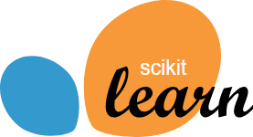

<h1 align="center">Hi there
</h1>

# 👨‍💻 About me
When I was in school, I really liked mathematics and geometry, but when I realized that mathematics is not limited to a piece of paper, I discovered Computer Science

I'm an amateur programmer who is fascinated by the intersection of math, biology, and code.
I like:
* Learning and programming different languages
* I enjoy designing model architectures, especially where they meet complex dynamics (snn)
* Building small tools and experiments from scratch

# 🛠️ Works with:
### Languages:
| Python | C++ |     | Rust |
|--------|-----|-----|------|
|||⠀⠀⠀⠀||

### Frameworks:
| Numpy  | Pandas | OpenCV | PyTorch | scikit-learn | | Polars |
|--------|--------|--------|---------|--------------|-|--------|
||||||⠀⠀⠀⠀||

# 📫 How to reach me
Telegram in bio

<!-- ### Others:
| pybind11 |
|----------|
||

<picture>
  <source media="(prefers-color-scheme: dark)" srcset="https://raw.githubusercontent.com/andrei1112111/andrei1112111/output/github-contribution-grid-snake-dark.svg">
  <source media="(prefers-color-scheme: light)" srcset="https://raw.githubusercontent.com/andrei1112111/andrei1112111/output/github-contribution-grid-snake.svg">
  
</picture>

<!--
### Frameworks:
<table border="1">
  <tr>
    <td></td>
    <td></td>
    <td></td>
    <td></td>
  </tr>
</table>

<!--
**GolomolzinDaniil/GolomolzinDaniil** is a ✨ _special_ ✨ repository because its `README.md` (this file) appears on your GitHub profile.

Here are some ideas to get you started:

- 🔭 I’m currently working on ...
- 🌱 I’m currently learning ...
- 👯 I’m looking to collaborate on ...
- 🤔 I’m looking for help with ...
- 💬 Ask me about ...
- 📫 How to reach me: ...
- 😄 Pronouns: ...
- ⚡ Fun fact: ...
-->
